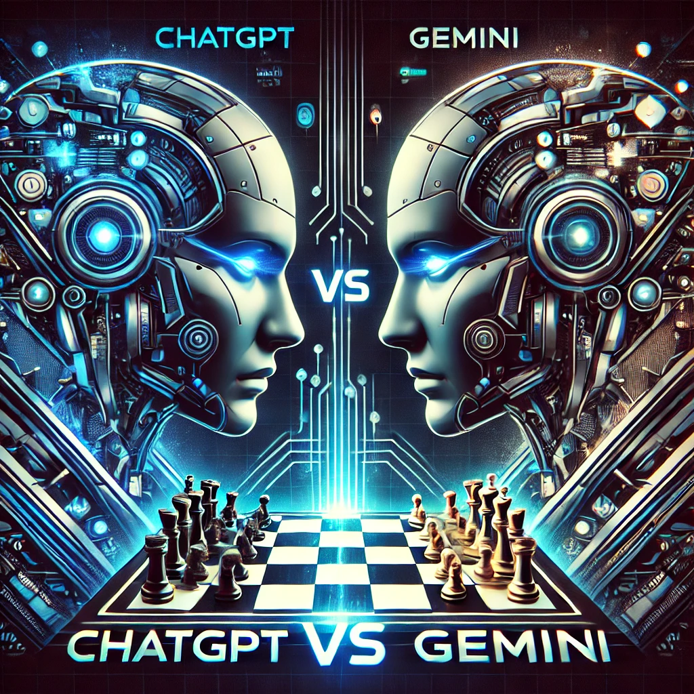

# AI Royals Showdown: ChatGPT vs. Gemini in Chess



Welcome to the **AI Royals Showdown**, where two of the most advanced AIs, **ChatGPT** and **Gemini**, compete in an epic chess battle! This project showcases the results of simulating **10 chess games** between these two supercomputers, along with the codebase used to run and analyze the games.

---

## 🧠 About the Project
This experiment pits **ChatGPT** and **Gemini** against each other in head-to-head chess matches. We used Python and APIs to:

1. Send the current chessboard state to each AI.
2. Retrieve the next legal move calculated by each AI.
3. Update the board and repeat the process until the game ends.

The simulation was conducted for **10 games**, and the results were analyzed for:
- Win rates by AI.
- Performance based on color (White vs. Black).
- Average game duration.

---

## 📊 Key Findings
1. **Winner vs. Loser**:
   - ChatGPT: **X Wins** 🏆
   - Gemini: **Y Wins** 🔥
2. **Color Advantage**:
   - ChatGPT performed better as **White**.
   - Gemini excelled as **Black**.
3. **Game Dynamics**:
   - Neither AI successfully checkmated the other.
   - Defensive strategies often led to draws, especially due to the **five-fold repetition rule**.
   - We modified the rules to count five-fold repetition as a loss to ensure a clear winner.
4. **Average Game Duration**:
   - Each game lasted approximately **Z seconds**.

---

## 🚀 How to Run the Code

1. **Clone the Repository**:
   ```bash
   git clone https://github.com/your-repo-name/ai-chess-showdown.git
   cd ai-chess-showdown
   ```

2. **Install Dependencies**:
   Ensure you have Python installed and set up the required libraries:
   ```bash
   pip install -r requirements.txt
   ```

3. **Run the Simulation**:
   ```bash
   python main.py
   ```
   This will run the AI chess matches and output the results.

4. **Optional: Analyze the Data**:
   Modify or review the code in `main.py` to adjust game parameters or analyze results further.

---

## 🛠️ Features
- Simulates chess games between two AIs using APIs.
- Keeps track of:
  - Wins and losses for each AI.
  - Win percentages based on color.
  - Average game duration.
- Outputs detailed game statistics.

---

## 📋 Limitations
1. **No Checkmates**:
   - Neither AI managed to achieve a checkmate; instead, they often forced draws via repetition.
2. **API Limitations**:
   - The experiment was limited to 10 games due to API request caps.
3. **Sample Size**:
   - While the sample size is small, the results were consistent and insightful.

---

## 📂 Project Structure
```
.
├── ui.py               # Code for running a single chess game between ChatGPT and Gemini
├── main.py             # Orchestrates multiple games and collects statistics
├── README.md           # Project documentation
├── requirements.txt    # Python dependencies
└── images/             # Chess piece assets
```

---

## 🤝 Contributing
We welcome contributions! If you’d like to improve the code, analyze more games, or extend this experiment, feel free to:
1. Fork the repository.
2. Create a new branch for your changes.
3. Submit a pull request.

---

## 📧 Contact
For questions, feedback, or collaboration opportunities, please contact:
- **Name**: Darold Kelly Jr.
- **Email**: [your-email@example.com]

---

## 📜 License
This project is licensed under the MIT License. See the `LICENSE` file for details.

---

## 🌟 Support the Project
If you enjoyed this experiment, please consider:
- ⭐ Starring this repository.
- 📝 Sharing your thoughts in the issues or discussions.
- 💰 Donating to support future experiments.

Thank you for your support and interest in the **AI Royals Showdown**!
